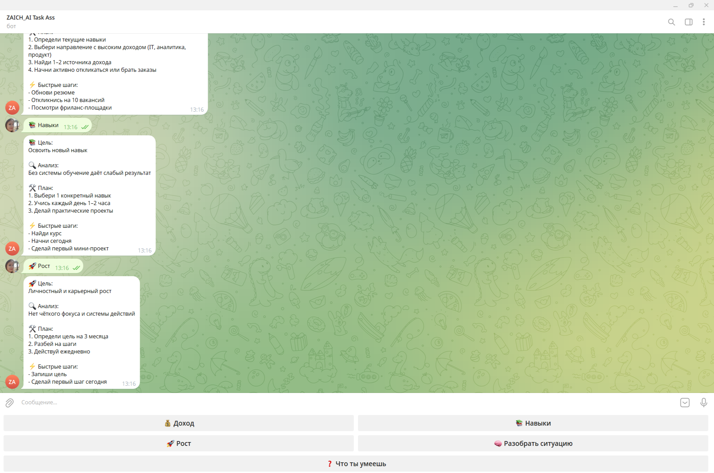

# 🤖 AI Telegram Task Assistant

## 🖼 Demo



🚀 Telegram-бот с логикой анализа пользовательских запросов и генерацией плана действий.

---

## ✨ Возможности

* 💰 Помогает увеличить доход
* 📚 Подсказывает, какие навыки развивать
* 🚀 Формирует план роста
* 🧠 Разбирает пользовательские ситуации
* 🎛 Удобный интерфейс с кнопками

---

## 🧠 Как работает

Пользователь пишет запрос → бот:

1. Определяет тему (доход / обучение / рост)
2. Анализирует запрос
3. Формирует структурированный ответ
4. Выдаёт план действий

---

## 🖼 Пример работы

**Запрос:**
хочу зарабатывать больше

**Ответ:**

💰 Цель:
Выйти на доход 300–500k+

🔍 Анализ:
Сейчас нет чёткой стратегии роста

🛠 План:

1. Определи навыки
2. Выбери направление
3. Найди источники дохода

⚡ Быстрые шаги:

* Обнови резюме
* Откликнись на вакансии

---

## 🧱 Архитектура

Telegram → bot.py → ai_service.py → ответ пользователю

---

## 📁 Структура проекта

ai-telegram-task-bot/

app/
  bot.py — логика бота
  ai_service.py — обработка запросов

requirements.txt
README.md
.env.example

---

## ⚙️ Запуск

```bash
pip install -r requirements.txt
python app/bot.py
```

Создать файл `.env`:

BOT_TOKEN=your_token

---

## 🚀 Возможности развития

* подключение реального AI (OpenAI)
* хранение истории пользователей
* персонализация ответов
* web-интерфейс

---

## 👩‍💻 Автор

System / Business Analyst
Фокус: AI, автоматизация, цифровые продукты

---

## ⭐ Ценность проекта

Проект демонстрирует:

* продуктовый подход
* работу с пользовательскими сценариями
* проектирование логики
* создание AI-подобного поведения

---

🚀 Готов к масштабированию в полноценный продукт
